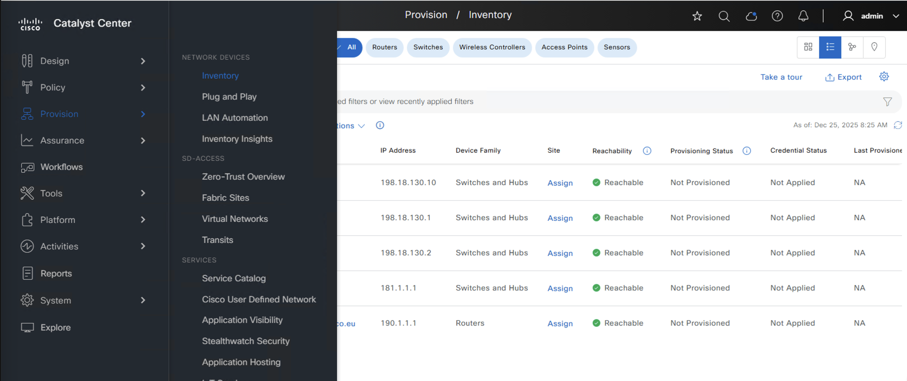
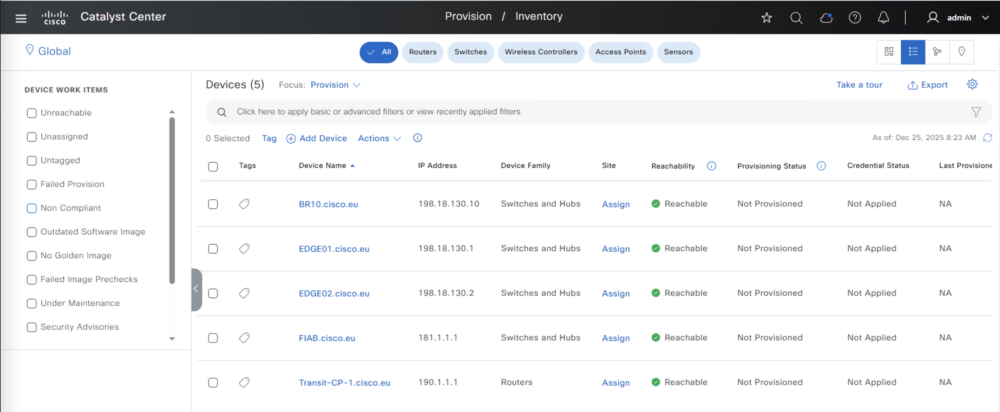

[](https://www.terraform.io)

# Cisco Network as Code for Catalyst Center - Comprehensive example

The goal of this example is to demonstrates how to instantiate and SD-Access Fabric using the **Network-as-Code (NAC) Module** approach to configuring Cisco Catalyst Center using YAML-based declarative configuration.

## Lab Access

If not already done, follow the [Lab Access Guide](../LAB_ACCESS.md) to access the Lab and clone the repositories

## 🎯 What This Example Does

Deploys a complete SD-Access fabric infrastructure to Catalyst Center:
- **3 Areas**: Global, Poland, Krakow
- **1 Building**: Bld A in Krakow
- **2 Floors**: Floor 1 and Floor 2 in Bld A
- **1 Global IP Pool**: Overlay (192.168.0.0/16) with 4 reservations
- **4 IP Pool Reservations**: CampusVN, GuestVN, PrintersVN, BYOD
- **4 Layer 3 Virtual Networks**: Campus, Guest, Printers, BYOD
- **1 Fabric Site**: Krakow with 4 anycast gateways
- **3 Fabric Devices**: 1 Border Router (BR10), 2 Edge Nodes (EDGE01, EDGE02)
- **1 L3 Handoff**: BGP peering to external network (Transit BGP65002)
- **AAA Server Configuration**: ISE integration with RADIUS
- **Network Profiles and Templates**: Pre-configured for fabric operations

**Total Resources Created**: 50+ fabric and infrastructure components

## 📁 File Structure

```
nac-catalystcenter-comprehensive-example/
├── main.tf                         # Terraform configuration using NAC module
└── data/
    ├── sites.nac.yaml              # Site hierarchy (areas, buildings, floors)
    ├── network_settings.nac.yaml   # IP pools, AAA servers, network settings
    ├── fabric.nac.yaml             # SD-Access fabric configuration (L3VNs, sites, borders)
    ├── devices.nac.yaml            # Network devices and fabric roles
    ├── network_profiles.nac.yaml   # Network profiles for device provisioning
    ├── templates.nac.yaml          # Configuration templates
    └── templates/
        └── ACL_Block.j2            # Jinja2 template for ACL configuration
```

**Note**: This comprehensive example demonstrates a full SD-Access fabric deployment with all necessary components: site hierarchy, IP addressing, fabric configuration, device provisioning, and configuration templates.

## 🚀 Quick Start

The NAC approach enforces a strict **separation of data from code** - a key principle that simplifies maintenance and enables reusability:
  
- **Code** (`main.tf`): Minimal "glue" file that links data to the NAC module
  - References the community-maintained NAC module from Terraform registry
  - Rarely changes - only when updating module version or directory structure

- **Data** (`data/` directory): Contains the desired state of your network in YAML files
  - Site hierarchy, IP pools, network settings - everything specific to YOUR environment
  - Can be updated independently without touching the Terraform code

This separation means you maintain only your network's desired state (YAML data), while the complex Terraform logic is handled by the centrally-maintained NAC module. Multiple teams can use the same proven codebase with their own configuration data.

**Learn More:** [Separate Data from Code Concept](https://netascode.cisco.com/docs/guides/concepts/separate_data_from_code/)

### 1. main.tf file

The `main.tf` file is the entry point for your Terraform deployment. It defines:
- **Provider Configuration**: Which Terraform provider to use (Catalyst Center)
- **Authentication**: How to connect to your Catalyst Center instance (URL, credentials)
- **NAC Module**: References the Network-as-Code module for simplified configuration
- **YAML Location**: Specifies where your configuration files are located (`data/` directory)

#### 1.1 Inspect the main.tf file

The `main.tf` file has been modified to point to the Catalyst Center in your lab, use the CiscoDevNet/catalystcenter terraform provider and the terraform module for Network as code for Catalyst Center


### 2. Inspect Data Folder

The `data/` folder contains all the YAML configuration files that define your SD-Access fabric infrastructure. These files work together to create a complete, production-ready SD-Access fabric deployment.

#### 2.1 Site Hierarchy (`sites.nac.yaml`)

Defines the site hierarchy including areas (Global, Poland, Krakow), buildings (Bld A), and floors. This establishes the geographic and logical organization of your network.

#### 2.2 Network Settings (`network_settings.nac.yaml`)

Contains IP addressing and network services configuration including the global Overlay IP pool (192.168.0.0/16), its four reservations (CampusVN, GuestVN, PrintersVN, BYOD), and AAA server settings for ISE integration.

#### 2.3 Fabric Configuration (`fabric.nac.yaml`)

Defines the SD-Access fabric components including Layer 3 Virtual Networks (L3VNs), fabric sites, anycast gateways, border devices, and L3 handoffs with BGP peering to external networks.

#### 2.4 Network Devices (`devices.nac.yaml`)

Specifies the network devices to be added to inventory and their fabric roles - one border router (BR10) with control plane and border node roles, and two edge nodes (EDGE01, EDGE02) with port assignments for user connectivity.

**Note**: All devices are configured with `state: INIT`, which means they will be added to the inventory but not fully provisioned. This allows you to verify device discovery and role assignment before proceeding with full provisioning.


#### 2.5 Network Profiles (`network_profiles.nac.yaml`)

Contains network profiles used for device provisioning and configuration templates.

#### 2.6 Configuration Templates (`templates.nac.yaml`)

References configuration templates (like ACL_Block.j2) that can be applied to devices for consistent policy enforcement.


### 3. Verify Initial Catalyst Center Configuration

Before deploying any configuration, verify that Catalyst Center has no sites, IP address pools, or fabric configuration:

1. Login to the Catalyst Center GUI using your credentials
2. Navigate to **Design > Network Hierarchy** to verify no sites exist (only the default "Global" site should be present)
3. Navigate to **Design > Network Settings > IP Address Pools** to verify no IP pools are configured
4. Navigate to **Provision > Fabric** to verify no fabric sites are configured

This baseline verification ensures you're starting with a clean slate and will help you clearly see the SD-Access fabric resources created by Terraform in the next step.

### 3. Deploy Base Configuration

Deploy the complete SD-Access fabric infrastructure:

```bash
terraform init
```

Review the changes:
```bash
terraform plan
```

Deploy to Catalyst Center:
```bash
terraform apply
```

**Expected Result**: ✅ Success on first apply - all 50+ resources created
- 3 Areas (Global, Poland, Krakow)
- 1 Building (Bld A)
- 2 Floors (Floor 1, Floor 2)
- 1 Global IP Pool (Overlay) with 4 reservations
- 4 IP Pool Reservations (CampusVN, GuestVN, PrintersVN, BYOD)
- 4 Layer 3 Virtual Networks (Campus, Guest, Printers, BYOD)
- 1 Fabric Site (Krakow) with 4 anycast gateways
- 3 Fabric Devices (BR10, EDGE01, EDGE02) with fabric roles
- 1 L3 Handoff with BGP peering
- AAA Server configuration (ISE integration)
- Network profiles and templates

### 4. Verify Catalyst Center Configuration

After the successful Terraform deployment, verify that the SD-Access fabric infrastructure has been configured correctly in Catalyst Center:

1. **Login to Catalyst Center GUI** using your credentials

2. **Verify Site Hierarchy**:
   - Navigate to **Design > Network Hierarchy**
   - Confirm all 3 areas are present:
     - Global
     - Poland
     - Krakow
   - Expand each area to verify the building (Bld A) and 2 floors are correctly created

3. **Verify IP Address Pools**:
   - Navigate to **Design > Network Settings > IP Address Pools**
   - Confirm the global IP pool exists:
     - Overlay (192.168.0.0/16)

   
     
   - Click on the pool to verify the 4 reservations:
     - CampusVN-IPPool (192.168.100.0/24)
     - GuestVN-IPPool (192.168.101.0/24)
     - PrintersVN-IPPool (192.168.102.0/24)
     - BYOD-IPPool (192.168.103.0/24)

   

4. **Verify SD-Access Fabric**:
   - Navigate to **Provision > Fabric**
   - Confirm the fabric site **Krakow** is present

   

   

   

   - Verify all 4 Layer 3 Virtual Networks are configured:
     - Campus
     - Guest
     - Printers
     - BYOD

   

   - Verify IP Transit exists

   

   - Navigate to **Provision > Inventory** and set focus to **Provision**

   

   - Check that the 3 fabric devices (BR10, EDGE01, EDGE02) 

   

   

This verification step ensures your Terraform deployment successfully created all the expected SD-Access fabric resources.


## 📚 Learning Path

**[← Back to Main README](README.md)** 

